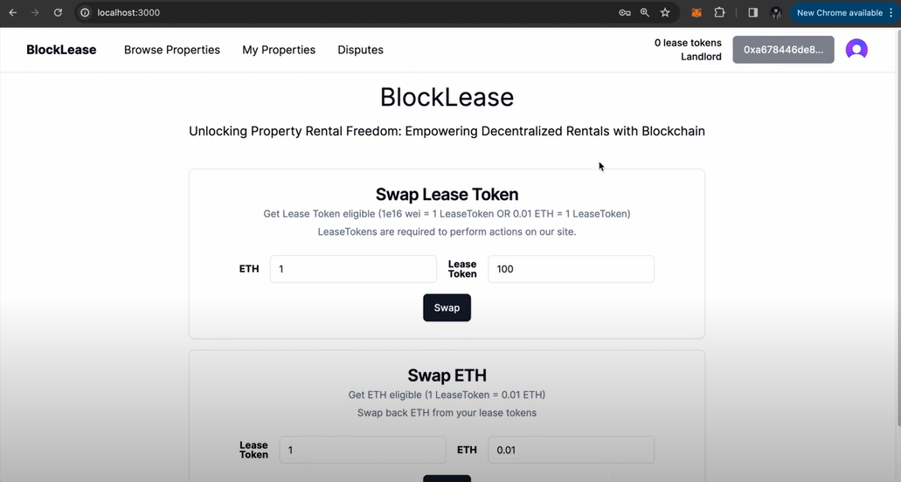
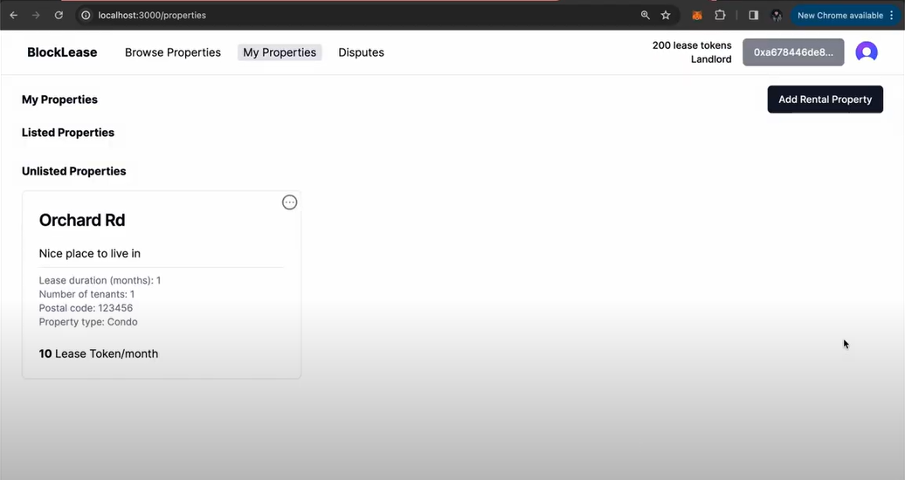
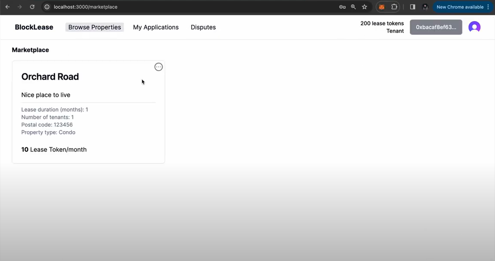
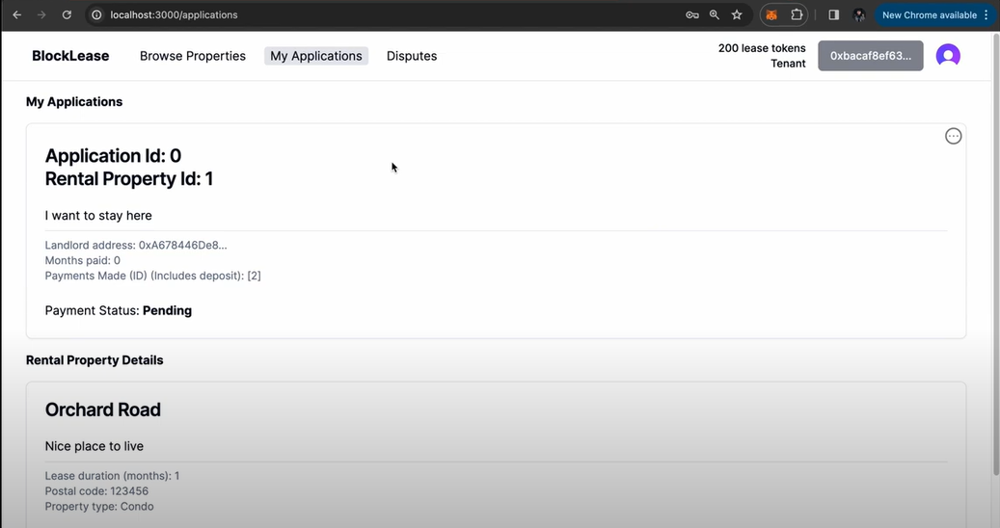
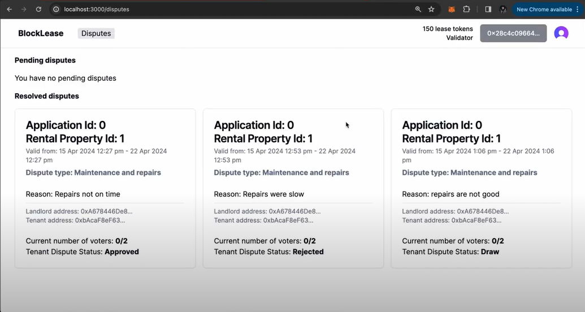

# IS4302 Group 13 Project : BlockLease - Decentralized Rental Ecosystem

BlockLease is a decentralized rental ecosystem built on blockchain technology, revolutionizing the traditional rental industry with transparency, security, and efficiency. Our platform facilitates seamless interactions between landlords and tenants, streamlining processes such as property listings, rental applications, agreements, payments, and dispute resolution. Real Estate Validators (a.k.a Experts or Gurus), can assess disputes and vote on resolutions, ensuring impartiality and fairness.

## Technology Stack
**Frontend**: NextJS, Shadcn UI, Tailwind CSS <br />
**Authentication**: Clerk  <br />
**Extension**: Metamask  <br />
**Backend**: Solidity (Truffle, Ganache)  <br />
**Libraries**: Ethers

## Functional Workflow
### 1. User Registration (Handled in Front-End)
* Landlord Registration: Landlords register on the platform, providing necessary details about themselves and the properties they wish to rent out.
* Tenant Registration: Potential tenants also register, providing their personal information and rental preferences.
* Real Estate Validators Registration: Potential Real Estate Gurus can register to participate in the dispute resolution process.
### 2. Rental Property Management (RentalProperty.sol)
* Property Addition: Landlords can add properties to the platform with details such as location, rental price, amenities, and lease terms, etc
* Property Deletion: Landlords can delete their properties from the platform if there are no ongoing applications from any tenant
* Property Update:  Landlords can update their properties from the platform if there are no ongoing applications from any tenant
* Note: When a rental property is added, the tenant still cannot browse and apply for the rental property yet since the rental property is not listed.
### 3. Rental Property Listing (RentalMarketplace.sol)
* Property Listing: Landlords can list their added properties with a deposit fee that tenants must pay during application. Landlords also must pay a protection fee to list their added properties as a safeguard to protect from potential disputes from tenants.
* Property Unlisting: Landlords can unlist their added properties if there are no ongoing applications from any tenant. Landlords will be refunded any remaining protection fee that is staked during listing. 
* Note: Only when the rental property is listed, then tenants can browse and apply for the rental property. 
### 4. Rental Application (RentalMarketplace.sol)
* Rental Search and Application: Tenants browse listed properties and apply for those that meet their preferences and requirements. Upon application, the tenant will transfer the deposit fee to the payment escrow.
  * Tenants can only make one rental application.
* Rental Cancellation:
  * If tenant cancels rental application before a landlord review the submission, the payment escrow refund the deposit fee to the tenant
* Application Review and Tenant Selection: Landlords review tenant applications, before selecting a tenant.
  * Rental Agreement : Upon tenant selection:
    * A digital rental agreement is created and signed by both parties.
    * The payment escrow release the deposit fee to the landlord
  * Rental Rejection :
    * No digital rental agreement is created
    * The payment escrow refund the deposit fee to the tenant
### 5. Tenancy and Payments (PaymentEscrow.sol)
* Ongoing Payments: Rent is paid monthly manually by the tenant through the platform (fixed rental amount based on agreement), from the tenant's account to the payment escrow. 
  * When the landlord approves the rent paid by the tenant, the rent will be released from payment escrow to landlord account.
* Rental Completion: Once a tenant complete payment for the entire lease period, he/she can choose to:
  * Move out: The tenant will move out from the rental property. Any remaining balance of deposit fee is transferred back to the tenant.
  * File a dispute: The tenant files a dispute and must stake voter rewards to incentives the Real Estate Validators/Reviewers. Tenants can only move out once the dispute is settled.
### 6. Dispute Resolution (RentDisputeDAO.sol)
* Dispute Initiation: In the event of disputes, such as property-related disputes or violations of lease terms, tenants submit a dispute claim at the end of the lease period (final month). Dispute claim includes the dispute type, dispute reason, start time, end time (start time + 7), etc.
* Dispute Resolution Process: A decentralized autonomous organization (DAO) handles disputes:
  * Real Estate Validators (a.k.a Guru or experts) assess the dispute based on provided evidence. Each of the Validators must stake Lease Token (a.k.a vote price) to participate in the dispute resolution process.
    * Each Real Estate Validators can only vote once for each dispute made.
    * Note that there are no voting weights for the votes. Each vote has the same weight (based on the vote price)
* A vote determines the outcome, favoring the tenant (dispute approved) or landlord (dispute rejected) or none (Draw).
* Dispute resolution can be triggered in 2 ways:
  * When the current time > end time of the dispute process
    * Process is triggered passively when the voter attempts to vote for a dispute that has exceeded the dispute end time.
  * When the minimum number of voters required has voted for the dispute
* Outcome if the Tenant Wins (Dispute Approved: Tenant Votes > Landlord Votes):
  * Landlord lose (1/total number of tenants) * protection fee amount that was staked earlier during listing.
  * Tenant will receive (1/total number of tenants) * protection fee amount that was stake by landlord
  * Voter reward that is staked by the tenant AND all vote prices (from all votes) is shared among all the winning voters.
  * Losing voters loses the vote price that was stake earlier to participate in the dispute process
* Outcome if the Landlord Wins (Dispute Rejected: Tenant Votes < Landlord Votes):
  * Tenants will lose ½ of the deposit amount.
  * Landlord will get to keep ½ of the deposit fee
  * Voter reward that is staked by the tenant AND all vote prices (from all votes) is shared among all the winning voters.
  * Losing voters loses the vote price that was stake earlier to participate in the dispute process
* Outcome if draw (Dispute Draw: Tenant Votes == Landlord Votes OR no voters after dispute process end time): 
  * Refund the voter reward back to the tenant
  * Refund all original stake amounts (Vote Price) to every voter.

## Technical Specifications and Other Assumptions
* Contracts: The primary contracts include RentalProperty, RentalMarketplace, PaymentEscrow, RentDisputeDAO, LeaseToken (for payments and rewards).
* Trust and Security: Transactions and interactions are secured by blockchain technology, ensuring integrity and trust.
* Token Economy: The platform uses a custom ERC-20 token for payments, security deposits, and rewards in the dispute resolution process.
* User Participation: The platform's success depends on active participation from landlords and tenants, fair dispute resolution from validators, and accurate property listings.
* Token Conversion Rate: 1 ETH = 100 LeaseToken = 1 x 10^16 Wei
* Fixed Platform Fee: Protection Fee, Voter Reward, and each Vote Price is specified by the platform.
* Deposit Fee: The deposit fee is specified by the Landlord during listing of property
* Dispute Initiations: Tenants retain the right to initiate a dispute for a rental property at the end of the lease period before moving out.
  * Dispute Restrictions: Only tenant can file for a dispute and each tenant can only file for one dispute for a rental property
* Voters Participation: Each Real Estate Validators can only vote once for a particular dispute.
* Non-Profit Platform: Our platform does not charge any commission fee for any transactions. It is totally free of charge for all users to utilize.
* Transaction Flow: Our platform uses LeaseToken for all transactions. All users have to exchange their ETH to LeaseToken prior to any transaction. Users can exchange LeaseToken to ETH at any point in time.

## Main User Interfaces
### Home Page
 <br />
### My Properties
 <br />
### Browse Marketplace
 <br />
### My Applications
 <br />
### Disputes
 <br />

## Test Case Documentation
### 1. Test Cases for Rental Property Management and Rental Property Marketplace
**Description**: Test cases for Rental Property Management and Rental Property Marketplace <br />
**Roles**: 1 Landlord, 3 Tenant <br />
**Run Command**: `truffle test ./test/test_marketplace.js` <br />

Rental Property Management
Test Cases (3):
1. Landlord add rental property
2. Landlord updates rental property
3. Landlord deletes their property listing

Rental Property Marketplace
Test Cases (19):
1. Tenants get LeaseTokens in exchange for ETH
2. Landlord CANNOT list property
3. Landlord CAN list a property on market place
4. Landlord can update property when there is no tenant applications
5. Landlord can unlist property when there is no tenant applications
6. Tenant can apply for rental property
7. Landlord cannot unlist property when there are applications
8. Landlord cannot update property when there are applications
9. Landlord cannot delete property when there are applications
10. Tenant cancel tenant rental application
11. Landlord accepts rental application
12. Landlord reject tenant rental application
13. Landlord accept payment for monthly rental fee from a tenant
14. Tenant cannot move out from rental property when payment not made for entire lease period
15. Tenant make payment for monthly rental fee
16. Landlord accept payment for monthly rental fee from a tenant
17. Tenant move out from rental property
18. Landlord unlist rental property
19. Landlord convert LeaseToken back to ETH

### 2. Test cases for Dispute Approve 
**Description**: Test cases for dispute APPROVED for rental property (tenant wins) <br />
**Roles**: 1 Tenant, 1 Landlord, 3 Validator <br />
**Run Command**: `truffle test ./test/test_disputeapprove.js` <br />

Test Cases (8):
1. Tenant can file for a dispute for a rental property
2. Tenant cannot move out of rental property in a dispute
3. Validators can vote for a dispute for a rental property (3 VALIDATORS)
4. Validators can only vote once for a dispute once for a rental property
5. Check Dispute APPROVAL outcome with voters
6. Tenant can only file for 1 dispute in the same rental property
7. Tenant move out of rental property (after dispute)
8. Landlord unlist the property

### 3. Test cases for Dispute Reject
**Description**: Test cases for dispute REJECTED for rental property (landlord wins) <br />
**Roles**: 1 Tenant, 1 Landlord, 3 Validator <br />
**Run Command**: `truffle test ./test/test_disputereject.js` <br />

Test Cases (8):
1. Tenant can file for a dispute for a rental property
2. Tenant cannot move out of rental property in a dispute
3. Validators can vote for a dispute for a rental property (3 VALIDATORS)
4. Validators can only vote once for a dispute once for a rental property
5. Check Dispute REJECTED outcome with voters
6. Tenant can only file for 1 dispute in the same rental property
7. Tenant move out of rental property (after dispute)
8. Landlord unlist the property
   
### 4. Test cases for Dispute Draw
**Description**: Test cases for dispute DRAW for rental property (No Winner)  <br />
**Roles**: 1 Tenant, 1 Landlord, 2 Validator  <br />
**Run Command**: `truffle test ./test/test_disputedraw.js`  <br />

Test Cases (12):
#### Draw outcome with voters
1. Tenant can file for a dispute for a rental property
2. Tenant cannot move out of rental property in a dispute
3. Validators can vote for a dispute for a rental property (3 VALIDATORS)
4. Validators can only vote once for a dispute once for a rental property
5. Check Dispute DRAW outcome with voters
6. Tenant can only file for 1 dispute in the same rental property
7. Tenant move out of rental property (after dispute)
8. Landlord unlist the property
#### Draw outcome with NO VOTERS
9. Tenant can file for a dispute for a rental property
10. Check Dispute Draw outcome with NO VOTERS
11. Tenant move out of rental property (after dispute)
12. Landlord unlist the property

## Instuctions to run test cases

1. Ensure that nodejs is installed

2. Install truffle

   ```bash
   npm install truffle -g
   ```

3. Install Ganache from [Truffle Suite](https://trufflesuite.com/ganache/)

4. Install all node dependencies

   ```bash
   cd IS4302-BlockLease
   npm install
   ```

5. Start up Ganache locally (Ensure that the server is running on port 7545 AND compiler version is `0.8.19`)

6. Compile the Truffle project smart contracts into bytecode for the EVM

   ```bash
   truffle compile
   ```

7. Deploy the Truffle project smart contracts on the Local Ganache blockchain

   ```bash
   truffle migrate
   ```

8. To run all 50 test cases

   ```bash
   truffle test
   ```

9. To run a specific test file

   ```bash
   truffle test ./test/test_marketplace.js
   truffle test ./test/test_disputeapprove.js
   truffle test ./test/test_disputereject.js
   truffle test ./test/test_disputedraw.js
   ```
   
## Instructions to run client

### Generating build and deploying onto Ganache

1. Start up `Ganache` as described in the documentation. **Ensure that you set the network ID to be `1337`.**
1. `npm install` from the root directory for dependencies to build and deploy the smart contracts.
1. Once done, `truffle compile` to check if the smart contracts are compilable.
1. Then, `truffle build` to generate the relevant build for the smart contracts.
1. Then, `truffle migrate` to deploy the relevant smart contracts onto Ganache.

### Running the client

1. `cd client` to enter the client directory.
2. Set up the `.env.local` as described in the documentation.
3. `npm install` to install the relevant modules required to run the frontend.
4. `npm run dev` to start up the client.
